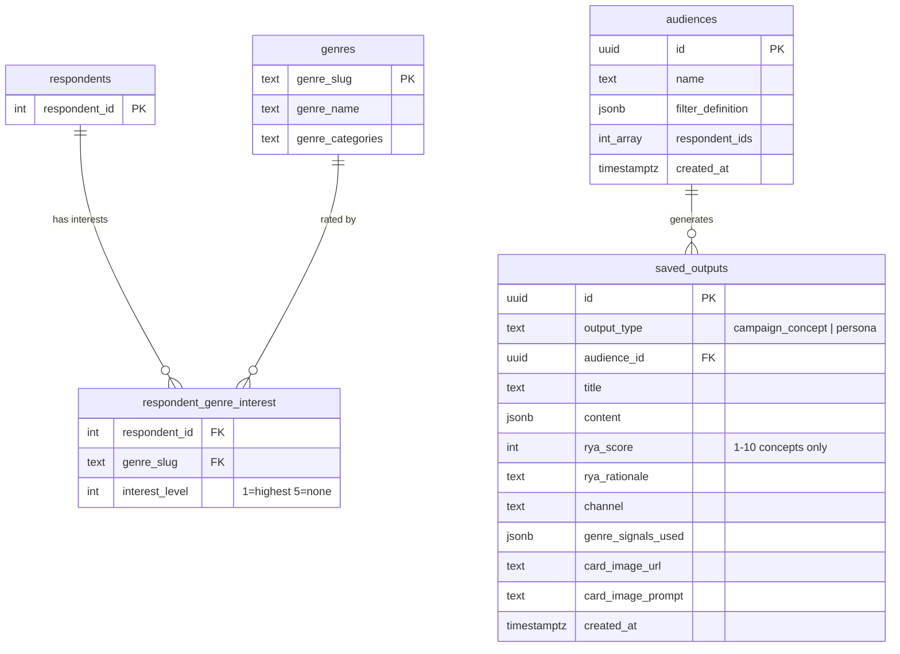

# Station Sierra

**AI-Powered Audience Intelligence for Campaign Strategists**

> Turn survey respondent data 📊 into grounded campaign concepts 💡 and audience personas in seconds 🌟🦿 — with every creative output citing the actual genre signals that inspired it.

## Screenshots


## What This Does

Station Sierra takes raw survey respondent data and turns it into actionable creative output. A marketer defines an audience segment by filtering on genre interest levels, sees how that segment differs from the overall population, then generates campaign concepts or audience personas grounded in the actual data — every output cites specific genre names and scores. The app includes a landing page at `/` introducing the product, with the full application at `/respondents`.

**Key Features:**
- :test_tube: **Generate → Evaluate → Refine Loop** — Every AI output passes schema, groundedness, and RYA evals before saving
- :satellite: **Full Observability** — Every LLM call traced in Arize Phoenix with eval results, token counts, and sanitization flags
- :dart: **Grounded Creative Output** — Campaign concepts and personas cite specific genre data points, never generic
- :lock: **Prompt Injection Defense** — Brief field sanitized against adversarial patterns before LLM injection
- :busts_in_silhouette: **Audience Segment Builder** — Define segments by genre interest filters with AND logic and live preview
- :bar_chart: **Delta Visualization** — See how a segment differs from the overall population with directional indicators
- :framed_picture: **DALL-E Card Images** — On-demand image generation grounded in audience signals, uploaded to Supabase Storage
- :last_quarter_moon_with_face: **Light + Dark Mode** — Full theme support across landing page and app shell

## Tech Stack

- **Frontend:** Next.js 15 (App Router), React 19, Tailwind CSS v4, Motion
- **Backend:** Next.js API Routes, Vercel AI SDK, Zod
- **Database:** PostgreSQL (Supabase local), Row-Level Security
- **AI:** OpenAI gpt-4o-mini via `generateObject()` — no streaming
- **Evals:** Schema compliance, groundedness, RYA range — pure functions, 44 unit tests
- **Observability:** Arize Phoenix, OpenTelemetry (OTLP protobuf)

## Quick Start

### Prerequisites

- Node.js 20+
- Docker (for Supabase)
- Python 3.10+ (for Phoenix)
- OpenAI API key

### Setup

```bash
# First-time bootstrap (installs deps, creates venv, starts Supabase, populates .env.local)
make setup

# Add your OpenAI key
echo 'OPENAI_API_KEY=sk-...' >> .env.local

# Start everything (Phoenix + Next.js)
make dev
```

Visit [http://localhost:3000](http://localhost:3000) for the app.
Visit [http://localhost:6006](http://localhost:6006) for Phoenix traces.

<details>
<summary>Manual setup (without Make)</summary>

```bash
# 1. Install dependencies
npm install

# 2. Start Supabase (applies migrations + seed data)
npx supabase start

# 3. Copy environment variables
cp .env.local.example .env.local
# Fill in OPENAI_API_KEY
# Supabase vars are pre-filled from supabase start output

# 4. Start Phoenix (LLM observability)
python3 -m venv .venv
.venv/bin/pip install arize-phoenix
.venv/bin/python -m phoenix.server.main serve &

# 5. Start dev server
npm run dev
```

</details>

## Available Commands

| Command | Purpose |
|---------|---------|
| `make setup` | First-time bootstrap (deps, venv, Supabase, .env.local) |
| `make dev` | Start Phoenix (background) + Next.js (foreground) |
| `make phoenix` | Run Phoenix in foreground (for debugging) |
| `make logs` | Tail Phoenix background log |
| `make check` | Verify Supabase, Phoenix, and Next.js health |
| `make test` | Run unit tests (44 tests across evals + genre signals) |
| `make test-gen` | Build gate verification (5+5 generations, eval checks) |
| `make reset-db` | Drop and re-create database (migrations + seed) |
| `make stop` | Stop Phoenix and Supabase |

## Architecture

```
┌─────────────────────────────────────────────────────────────┐
│                    Frontend (Next.js 15)                      │
│  ┌──────────────┐  ┌──────────────┐  ┌──────────────┐      │
│  │ Respondent   │  │ Audience     │  │ Generate     │      │
│  │ Explorer     │  │ Builder      │  │ Panel        │      │
│  └──────────────┘  └──────────────┘  └──────┬───────┘      │
│                                              │               │
├──────────────────────────────────────────────┼───────────────┤
│                    API Routes                 │               │
│  ┌────────────────────────────────────────────▼────────────┐│
│  │ POST /api/generate/concept | persona | card-image      ││
│  │                                                         ││
│  │  ┌─────────┐    ┌──────────┐    ┌───────────┐         ││
│  │  │Generate │───▶│ Evaluate │───▶│  Refine   │         ││
│  │  │(gpt-4o- │    │ (3 evals)│    │ (targeted │         ││
│  │  │ mini)   │    │          │    │  prompt)  │         ││
│  │  └─────────┘    └──────────┘    └─────┬─────┘         ││
│  │       ▲              │                 │               ││
│  │       └──────────────┴─────────────────┘  max 3       ││
│  └─────────────────────────────────────────────────────────┘│
│           │                    │                             │
│     ┌─────▼─────┐      ┌──────▼──────┐                     │
│     │  Supabase │      │Arize Phoenix│                     │
│     │ (save +   │      │ (trace every│                     │
│     │  storage) │      │  LLM call)  │                     │
│     └───────────┘      └─────────────┘                     │
└─────────────────────────────────────────────────────────────┘
```

## Database



## Project Structure

```
├── app/
│   ├── (landing)/              # Landing page (navbar + hero + footer, no sidebar)
│   ├── (app)/                  # Main app (sidebar layout)
│   │   ├── respondents/        # Respondent explorer
│   │   ├── audiences/          # Audience builder + detail
│   │   └── concepts/           # Saved outputs browser
│   ├── api/
│   │   └── generate/           # concept/ persona/ card-image/
│   └── components/             # Shared UI (sidebar, generate panel, etc.)
├── lib/
│   ├── evals.ts                # Eval layer (schema, groundedness, RYA)
│   ├── genre-signals.ts        # Genre analytics engine (pure functions)
│   ├── prompts.ts              # LLM prompt templates
│   ├── schemas.ts              # Zod output schemas
│   ├── sanitize.ts             # Brief field prompt injection defense
│   ├── telemetry.ts            # OpenTelemetry tracer for Phoenix
│   └── __tests__/              # 44 unit tests (evals + genre-signals)
├── supabase/
│   ├── migrations/             # Schema + RLS policies
│   └── seed.sql                # CSV import (12 respondents, 10 genres, 120 interests)
├── data/                       # Source CSVs
├── docs/                       # PRD, ai-layer spec, data model, mockups
├── plans/                      # Implementation plans (tracer-bullet phases)
└── Makefile                    # setup, dev, test, check, stop
```

## AI Layer

### How It Works

Every generation request executes a **generate → evaluate → refine** loop, up to 3 attempts. On attempt 1, the route computes genre signals for the audience, constructs a generation prompt with those signals interpolated, and calls `generateObject()`. The completed output is then run through the eval layer. If any eval fails and attempts remain, a targeted refinement prompt citing the specific failure is sent — not a generic retry. On all evals passing, the output is saved to Supabase and returned. On exhaustion, the route returns a structured 422 with the failure reason.

### Eval Layer

| Eval | Checks | Applies To |
|------|--------|------------|
| Schema Compliance | Output matches Zod schema (all required fields present and typed) | Both |
| Groundedness | Narrative text cites ≥2 genre names from the provided signals | Both |
| RYA Range | Score is integer 1–10 with non-empty rationale citing genre data | Concept only |

All evals are pure functions — no LLM calls, no database access, testable with fixture data. 44 unit tests cover pass and fail cases across both output types.

### Build Gate Results

Verified 2026-04-03. All criteria met before any UI code was written.

| Check | Result |
|---|---|
| 5 consecutive concept generations pass all evals | 5/5 PASS, all first attempt |
| 5 consecutive persona generations pass all evals | 5/5 PASS, all first attempt |
| 404 on non-existent audience_id | PASS (returns 404, not 500) |
| Unit tests (44 tests across evals + genre-signals) | 44/44 PASS |

**Clean passing trace:**

```json
{
  "title": "Unlock the Code: A Journey into Emerging Tech",
  "channel": "Social Media (YouTube for tutorials and Instagram for docuseries)",
  "concept": "The \"Unlock the Code\" campaign by TechCo aims to engage Emerging Tech Professionals by merging their passion for practical knowledge with their intrigue in tech innovation. Centered around How-To Content, the campaign will feature a series of interactive tutorials and webinars that cover the latest trends and applications in the industry. This approach aligns seamlessly with the audience's top interests, offering them direct access to expertise in Coding / Robotics. By showcasing real-world applications of tech tools, the campaign empowers emerging tech professionals to not only learn but also to create and innovate using the new developer tool.",
  "rya_score": 7,
  "rya_rationale": "The campaign's RYA score of 7 reflects its innovative approach to inviting Emerging Tech Professionals into an interactive learning ecosystem while leveraging their top interests. The inclusion of How-To Content and Coding / Robotics addresses their strong enthusiasm for hands-on learning and practical applications, scoring 1.00 and 1.33 respectively.",
  "genre_signals_used": [
    { "genre_name": "How-To Content", "avg_score": 1.0 },
    { "genre_name": "Coding / Robotics", "avg_score": 1.33 }
  ]
}
```

**Span:** `generate.concept` (OK, 9239ms) | **Audience:** Emerging Tech Professionals (3 respondents) | **Model:** gpt-4o-mini | 739 prompt tokens | 403 completion tokens | 1 attempt
**Eval results:** schema_compliance=PASS, groundedness=PASS (3 genres cited), rya_range=PASS (score 7, rationale present)

## Key Decisions & Assumptions

> Documenting how I thought through ambiguity in the assignment. Each decision includes the reasoning — not just what, but why.

**1. AI reliability layer before UI.**
The submission instructions note vibecoded products are the bare minimum. I built the generate→evaluate→refine loop, eval layer, and Phoenix instrumentation before writing any UI code. The build gate required 5 consecutive passing generations per route and manual trace review before proceeding.

**2. Filter rules stored as JSONB, not static ID arrays.**
`audiences.filter_definition` stores the segment logic, not just resolved IDs. When demographic data is added to respondents, the same filter system extends without schema changes. Cached `respondent_ids` array keeps queries fast.

**3. Pure-function eval and genre signals modules.**
The eval layer and genre signals engine have zero side effects — no database calls, no network. This makes them testable with fixture data (44 unit tests) and means eval logic can't be blamed for flaky integration issues.

**4. No streaming — loading UX compensates for async wait.**
The eval loop requires complete output before validation, so streaming is off the table. To compensate, the generate panel displays an animated loading state: a rotating set of 20 curated verbs ("Conjuring," "Forging," "Materializing"...) with a shimmer gradient animation (`background-clip: text` sweep), cycling every 2.5 seconds with a random start index so repeated generations feel different. This turns a 3-15 second wait into a moment of personality rather than dead air.

**5. Targeted refinement prompts, not generic retries.**
On eval failure, attempt 2+ receives a refinement prompt citing the specific eval that failed ("your narrative did not cite any genre names"). This is more token-efficient and converges faster than re-running the same generation prompt.

**6. Brief field sanitization as defense-in-depth.**
The brief is free-text user input injected into the LLM prompt. Regex-based sanitization catches common prompt injection patterns. Logged to Phoenix spans for auditability. Not foolproof, but raises the bar above zero.

**7. Inverted interest scale handled at every layer.**
1 = highest interest is counterintuitive. Rather than normalizing once, every sort, bar chart, and delta formula explicitly accounts for inversion with inline comments. This prevents the silent bug where a future contributor assumes 5 = most interested.

**8. Respondents table is identity-only.**
The provided CSV has no demographic data. Rather than fabricating attributes, I stored respondent_id as the sole column and documented the assumption. The segment builder operates on genre interest data alone.

## How I Used AI

**Workflow, not prompting.** I used Claude Code with a custom skill system designed to keep the LLM context window small and force structured thinking before code generation:

1. `/grill-me` — design-tree interrogation that resolves every branch before committing
2. `/write-a-prd` — generates a full PRD from the interview output
3. `/prd-to-plan` — breaks the PRD into thin vertical "tracer bullet" slices
4. Specialized skills (`/eval-layer`, `/generate-prompts`, `/setup-phoenix`) for domain-specific implementation

**What it did well:**
- Pure-function modules (evals, genre signals) — generated correctly on first pass given precise Zod schemas and fixture data in the PRD
- Prompt templates — once the PRD specified exact output fields, the generation and refinement prompts were accurate
- Boilerplate — Supabase migrations, RLS policies, API route scaffolding

**Where I course-corrected:**

- **Eval format drift.** Claude consistently generated evals with non-binary outputs (scores, percentages) instead of the pass/fail format required by the refinement loop. Verbal correction didn't stick. Fix: I wrote a dedicated `/eval-layer` skill with explicit binary constraints that forced compliance on every invocation.

- **Phoenix instrumentation.** Claude defaulted to `@opentelemetry/exporter-trace-otlp-http` (JSON) and port 4317 (gRPC) — neither works with Phoenix, which requires protobuf on port 6006. This silently produced zero traces. Fix: I iterated on a `/setup-phoenix` skill encoding the correct exporter and endpoint, verified with 12/12 visible traces.

- **UI fidelity from mockups.** Complex interactions (shimmer animations, delta bar spacing, dark mode color tokens) were consistently hand-waved or approximated. Fix: I used `/grill-me` to interrogate each UI branch before implementation and `/prd-to-plan` to break visual work into thin slices with explicit acceptance criteria — reducing the gap between mockup and output.

## Environment Variables

Copy the example file and add your OpenAI key:

```bash
cp .env.local.example .env.local
```

| Variable | Purpose | Default |
|----------|---------|---------|
| `NEXT_PUBLIC_SUPABASE_URL` | Supabase API endpoint | Pre-filled (local) |
| `NEXT_PUBLIC_SUPABASE_ANON_KEY` | Supabase anonymous key | Pre-filled (local) |
| `SUPABASE_SERVICE_ROLE_KEY` | Server-side Supabase operations | Pre-filled (local) |
| `OPENAI_API_KEY` | OpenAI API access for gpt-4o-mini | **You must provide** |

> Supabase keys are the standard local dev keys from `supabase start` and are pre-filled in `.env.local.example`.

## Troubleshooting

**Supabase won't start?**
Make sure Docker is running. Then: `make reset-db`

**Port 3000 already in use?**
`lsof -ti:3000 | xargs kill -9 && make dev`

**Phoenix shows no traces?**
Verify Phoenix is running at [http://localhost:6006](http://localhost:6006). If traces still missing, check that `instrumentation.ts` uses `exporter-trace-otlp-proto` (not `-http`) and the endpoint is port 6006 (not 4317). Run `make check` to verify all services.

**Generation routes returning errors?**
Confirm `OPENAI_API_KEY` is set in `.env.local`. Run `make check` to verify service health.

## Further Reading

| Document | Purpose |
|----------|---------|
| [docs/PRD.md](docs/PRD.md) | Full product requirements (33 user stories) |
| [docs/ai-layer.md](docs/ai-layer.md) | AI reliability spec (build gate, eval loop, security) |
| [docs/data-model.md](docs/data-model.md) | Database design, interest scale, delta formulas |
| [docs/mockups.md](docs/mockups.md) | ASCII UI mockups (15 views) |
| [plans/](plans/) | Implementation plans (tracer-bullet phases) |
